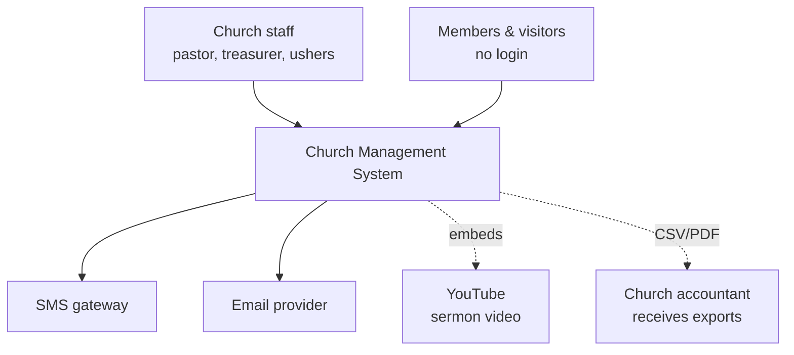
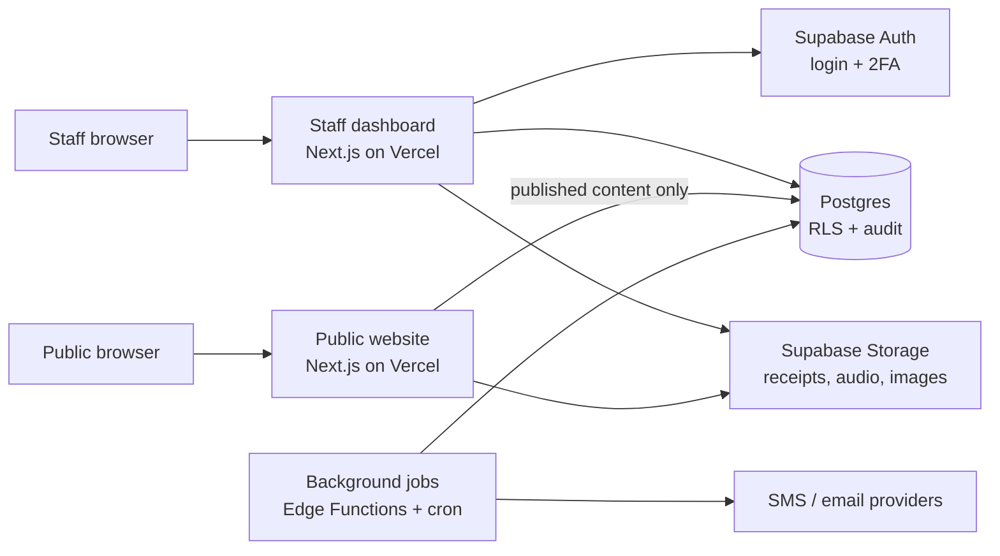
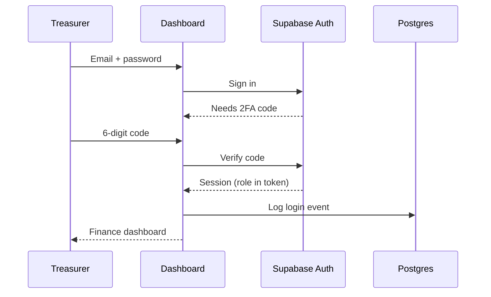
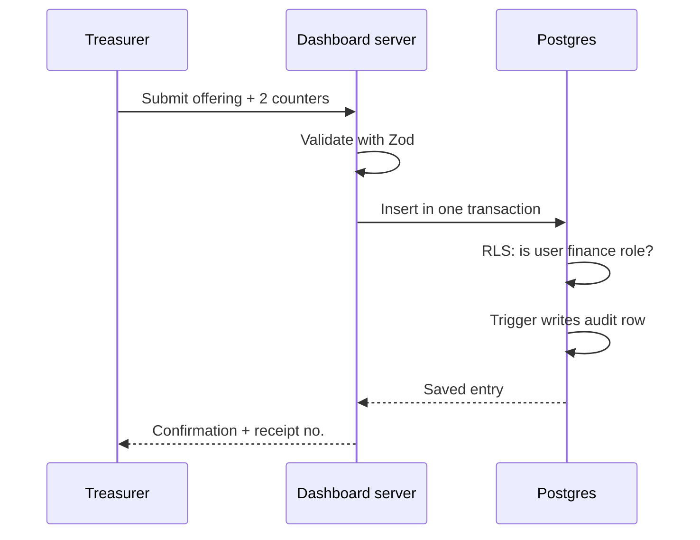
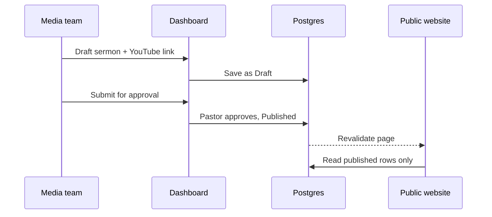
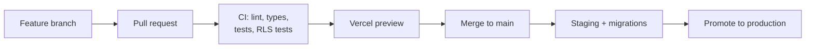

# Church Management System: System Architecture

Sep 24, 2026 · @Kofi

## Summary & principles

The system is two Next.js web apps (a private staff dashboard and a public website) sharing one managed Postgres database on Supabase, deployed on Vercel. The database itself enforces permissions and records the audit trail, so a bug in the app code cannot leak or silently change data. This document implements the [PRD](https://claude.ai/code/artifact/222bd20d-dd30-4be4-a961-d4fe1278bcb8); requirement IDs (e.g. FIN-06) refer to it.

**Principles**

1. **Security in the database, not just the UI.** Row-level security decides who sees what; hidden buttons are convenience, not protection.
2. **Nothing important is ever overwritten.** Finances are append-only with reversal entries; every change lands in the audit log.
3. **Managed over hand-built.** Use proven services for auth, storage, email, SMS and video instead of writing them. One developer can't safely own them all.
4. **Public and private stay separate.** The public site can only read published content.
5. **Boring, well-documented tools.** Choose tech a future volunteer developer can pick up in a week.
6. **The church owns everything.** All accounts belong to a church email with two admins (see PRD risks).

## System context (C4 level 1)

Two kinds of people use the system: staff through the private dashboard, and members and visitors through the public website. Everything outside the box is a service we rent, not build.



The accountant is not a user; they receive monthly exports (FIN-07, RPT-02). Online giving, if added, becomes another external box (a payment provider), never card handling inside the system.

## Containers (C4 level 2)

Inside the system there are two apps and one Supabase project. Both apps live in one Git repository (a monorepo) so they share types, UI components and database code.



| Container | Responsibility | Talks to |
| --- | --- | --- |
| Staff dashboard | All staff features (PRD Phases 1–4) and the Content section | Auth, Postgres, Storage, via server-side code |
| Public website | Church history, weekly activities, sermons, quote of the week, announcements (Phase 5) | Postgres read-only (published rows), public Storage files |
| Supabase Auth | Staff accounts, sessions, two-factor codes | Dashboard |
| Postgres | All data; row-level security; audit triggers; finance ledger | Everything |
| Supabase Storage | Receipt photos (private bucket), sermon audio and images (public bucket) | Dashboard, public site |
| Background jobs | Send queued messages, expire announcements, scheduled publishing, nightly checks | Postgres, SMS/email providers |

**Repository layout**

```
church-cms/
  apps/
    dashboard/     # staff app
    web/           # public website
  packages/
    db/            # pinned Supabase CLI and generated types
    ui/            # shared components
    config/        # lint, TypeScript, shared Tailwind v4 theme (CSS @theme tokens)
    providers/     # SMS / email / payment / monitoring adapters (ADR-016)
  supabase/
    migrations/    # SQL migrations, RLS policies, functions
    tests/         # pgTAP tests
    seed.sql       # fake demo data
    functions/     # edge functions (background jobs)
  docs/
    prd.md  architecture.md  adr/  runbook.md
```

## Tech stack

Every choice below is proposed until its ADR is written and accepted. The bias is toward what you already know (frontend) plus managed services for the risky backend parts.

| Layer | Choice | Why | ADR |
| --- | --- | --- | --- |
| Build vs buy | Build, custom | Local payment methods, church-specific finance flow, cost, learning (to confirm) | ADR-001 |
| Language | TypeScript everywhere | One language front to back; types catch finance bugs early | ADR-002 |
| Web framework | Next.js (App Router) for both apps | Plays to your frontend skills; server-side code keeps secrets off the browser | ADR-003 |
| Database, auth, storage | Supabase (Postgres) | Relational data fits members and money; built-in RLS, 2FA, backups; less backend to hand-roll | ADR-004 |
| Data access | SQL migrations + generated types (Supabase CLI) | Schema changes are versioned and reviewable | ADR-005 |
| UI | Tailwind CSS v4 (latest stable, 4.3.x at time of writing, exact version pinned) + shadcn/ui | Accessible components, consistent design, fast to build | ADR-006 |
| Forms & validation | React Hook Form + Zod | Same validation rules on browser and server | ADR-007 |
| Hosting | Vercel | Preview deploy per pull request; zero server maintenance | ADR-008 |
| Background jobs | Supabase Edge Functions + pg\_cron | Scheduled and queued work without running a server | ADR-009 |
| Messaging | Local SMS gateway + transactional email service (vendors TBD) | Local delivery rates and pricing matter most | ADR-010 |
| Media | YouTube embeds for video; Storage for audio | Streaming video yourself is costly and hard | ADR-011 |
| Monitoring | Sentry (errors) + an uptime monitor | Hear about failures before the pastor does | ADR-012 |
| Testing | Vitest (unit), Playwright (end-to-end), pgTAP (RLS policies) | Finance logic and permissions are tested automatically | ADR-013 |
| Monorepo | pnpm workspaces + Turborepo | Two apps sharing code without copy-paste | ADR-014 |
| API | GraphQL via Supabase pg\_graphql; business rules in Postgres functions; typed client with GraphQL Code Generator | One typed schema for both apps; queries still run as the signed-in user, so RLS stays the final authority | ADR-015 |

**Avoided on purpose:** microservices, a separate custom backend server, Kubernetes. At 200–1,000 members they add moving parts without any benefit.

### API layer: GraphQL

Both apps talk to the database through GraphQL. The proposal is Supabase's built-in GraphQL endpoint (pg\_graphql), which generates the schema from the database and applies row-level security to every query, rather than a hand-written GraphQL server that would have to re-implement every permission check.

- **Reads** (members, attendance, reports, public content) use generated queries.
- **Writes with business rules** (record offering, reverse an entry, close a month, approve an expense) are Postgres functions exposed as mutations, so the rule lives in one place and runs in one transaction.
- **Client:** GraphQL Code Generator produces TypeScript types and hooks from the schema; a lightweight client (urql or Apollo, ADR-015) handles caching.
- **Guardrails:** introspection off in production; query depth and size limits; persisted (allow-listed) queries for the public site so it can only run the handful of queries it needs.
- **Public site:** uses the anonymous role, which RLS limits to published content, so the GraphQL schema it can reach exposes nothing private.

**Alternative considered:** a custom server (GraphQL Yoga + Pothos inside Next.js). More control over schema shape, but every resolver must check permissions correctly by hand. Revisit only if pg\_graphql's generated schema becomes limiting.

## Cost stance: free now, paid later

Until church leadership reviews a working demo, the project spends nothing. Everything runs on free tiers with fake seed data, and every future paid service sits behind a small adapter so it can be switched on later without rewriting features (ADR-016).

| Need | Demo (now, free) | Later (after church review) | Adapter |
| --- | --- | --- | --- |
| Database, auth, storage | Supabase free plan, one hosted demo project + local | Supabase paid plan with daily backups | None (same platform) |
| Hosting | Vercel free plan, `*.vercel.app` URLs (check its terms for church use) | Paid plan if required; custom domain | None |
| SMS | Outbox only: messages saved and shown in a "sent" log, nothing delivered | Local SMS gateway | `SmsProvider` |
| Email (beyond login emails) | Outbox only, or a free-tier email service | Transactional email service | `EmailProvider` |
| Online giving | Not built; UI shows "coming soon" | Payment provider (mobile money, cards) | `PaymentProvider` |
| Error tracking & uptime | Free tiers, or console logging | Paid tiers if limits are hit | `Monitoring` |
| Backups | Weekly manual `pg_dump` export | Automatic daily backups | None |
| Domain name | None | Church domain | None |
| Sermon video | YouTube embeds (free) | Same | None |

**The adapter pattern.** Features never call a vendor directly; they call an interface, and configuration picks the implementation.

```ts
// packages/providers/sms.ts
export interface SmsProvider {
  send(to: string, body: string): Promise<{ id: string; status: 'queued' | 'sent' | 'failed' }>
}

// Demo: writes to the message_outbox table, delivers nothing
export const outboxSms: SmsProvider = { /* ... */ }

// Later: e.g. a local gateway, added without touching the Messaging feature
// export const gatewaySms: SmsProvider = { ... }
```

The same shape applies to email, payments and monitoring. A `features` table (or environment flags) switches paid modules on per environment, so the demo can show a module as "coming soon" while the code path is already in place.

**Demo rules.** No real member, child or financial data goes into the free-tier project: free plans have limited backups and projects pause after a period of inactivity. Real data waits for the paid plan approved in the church review.

## Key flows

Three flows show how the pieces work together; the rest follow the same patterns.

### 1. Staff login with two-factor



The role travels in the session token, and the database checks it on every query.

### 2. Recording an offering (FIN-01, FIN-06, AUD-01)



A correction is a new reversal entry pointing at the original, never an UPDATE. A closed month rejects all inserts (FIN-07).

### 3. Publishing a sermon (CNT-03, CNT-07)



The public site caches pages and refreshes when content is published, so it stays fast and puts almost no load on the database.

## Security architecture

Security rests on three layers: who you are (Auth + 2FA), what you may touch (row-level security per role), and a permanent record of what you did (audit log). A failure in one layer is caught by the next.

**Trust boundaries**

| Zone | Trusted with | Never trusted with |
| --- | --- | --- |
| Browser (any) | Nothing; all input re-validated on server | Service keys, other users' data |
| Public website server | Anonymous key: read published content | Members, attendance, finance, audit tables |
| Dashboard server | User's own session; acts as that user | Service role key (only background jobs hold it) |
| Background jobs | Service role key, provider API keys | Direct user input without validation |
| Postgres | Final say on every permission | None |

**Permissions.** Each PRD role maps to a database role claim. RLS policies on every table check it, e.g. only finance roles may insert into offerings, and department heads see only rows for their department. RLS policies get their own automated tests, since one wrong policy is a data leak.

**Audit trail.** A Postgres trigger on every business table writes who, what, when, old value and new value to an `audit_log` table. App users have INSERT-only rights there: no UPDATE or DELETE, not even for Super Admin. Logins and exports are logged too.

**Money.** Finance tables are append-only ledgers. Amounts are stored as integers in the smallest currency unit (pesewas/cents), never floating point.

**Data at rest and in transit.** HTTPS only; Supabase encrypts storage at rest. Receipt photos sit in a private bucket served through short-lived signed links.

**Secrets.** Keys live in Vercel and Supabase environment settings, never in Git. Separate keys per environment; rotated when anyone with access leaves.

**Public forms.** Contact and "I'm new" forms use rate limiting and a bot check, and write to a staging table staff review before anything becomes a visitor record.

**Children's data.** Records of under-18s carry a flag; RLS restricts them to children's ministry leads and admins, and they never appear in public content.

## Environments, deployment & operations

Code moves through three environments, and nothing reaches production without passing automated checks and a pull request review.

| Environment | Purpose | Data | Deploys when |
| --- | --- | --- | --- |
| Local | Your laptop, Supabase running in Docker | Fake seed data | Always |
| Staging | Final check; staff try new features | Fake or anonymised data, never real members | Merge to `main` |
| Production | The live system | Real data | Manual promote after staging passes |



CI runs on GitHub Actions. Database migrations run on staging first; a migration that fails there never touches production.

**Operations**

| Concern | Approach | Target |
| --- | --- | --- |
| Backups | Demo: weekly manual export. Production: Supabase daily backups + a weekly off-site export | Lose at most 24 hours of data |
| Recovery | Documented restore steps in the runbook, rehearsed quarterly | Back online within 4 hours |
| Errors | Sentry in both apps, alerts to the dev and a backup contact | Known within minutes |
| Uptime | External monitor pings both apps every 5 minutes | 99.5% monthly |
| Costs | Budget alerts on Vercel and Supabase; SMS spend cap | Within agreed monthly budget |
| Sunday fallback | Printed attendance and offering sheets, entered afterwards | Service never blocked by an outage |
| Releases | No production deploys Saturday evening to Sunday afternoon | Zero surprises during services |

## Open decisions & next documents

**Open decisions**

- [ ] Offline attendance: make the dashboard an installable PWA that queues check-ins when the hall has no signal? Decide before Phase 2.
- [ ] SMS gateway and email provider: compare local pricing and delivery rates (ADR-010).
- [ ] Public site in the same repo and Supabase project, or fully separate project for stronger isolation? Current proposal: same repo, same project, locked down by RLS.
- [ ] Supabase plan: free tier pauses inactive projects and has limited backups; the demo stays on free tier with seed data; the paid plan is requested in the church review, before any real data goes in.
- [ ] Data residency: check whether local law restricts storing member data outside the country, and pick the Supabase region accordingly.

**Next documents**

| Order | Document | Covers |
| --- | --- | --- |
| 1 | ADR-001 to ADR-004 | Build vs buy, TypeScript, Next.js, Supabase |
| 2 | System design | Data model (ERD), tables, RLS policies per role, GraphQL schema, queries and mutations, audit trigger design |
| 3 | Threat model | Attack scenarios and defences |
| 4 | Test strategy | What is tested, how, coverage for finance and permissions |
| 5 | Runbook | Deploy, restore, rotate keys, onboard/offboard staff, incident steps |
