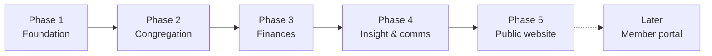

# Church Management System — Product Requirements (PRD)

Sep 24, 2026 · @Kofi

## Overview

We are building a secure, web-based church management system (ChMS) that lets staff manage members, attendance, programs, finances and communication in one place. It replaces scattered spreadsheets, paper registers and WhatsApp threads with one accurate, auditable source of truth.

**Problem.** Member records, attendance counts and giving records live in different places and different hands. Totals are hard to reconcile, history is easy to lose, and nobody can see who changed what.

**Goals**

- One trusted record for every member and visitor.
- Accurate, reconcilable financial records with a tamper-evident audit trail.
- Non-technical staff can do their daily work without developer help.
- Leadership can see attendance and giving trends without manual counting.

**Success metrics (first 6 months after launch)**

| Metric | Target |
| --- | --- |
| Active members recorded in the system | 95% of the congregation (200–1,000 people) |
| Services with attendance recorded | 100% of Sunday services |
| Offering records reconciled with bank deposits | 100% each month, discrepancies explained |
| Staff tasks needing developer help | Under 2 per month |
| Unplanned downtime | Under 4 hours per month |

**Member-facing content.** Church members and visitors get a public website (Phase 5) with the church's history, weekly activities, sermons, quote of the week and announcements. Staff publish all of it from this dashboard, so there is one system to maintain.

## Users & roles

Access is role-based: every staff account gets one or more roles, and each role sees only what it needs. Members and visitors do not log in during Phases 1–4; they are records, not users.

| Role | Who | Main jobs |
| --- | --- | --- |
| Super Admin | 1–2 trusted people (e.g. church administrator, developer) | Manage users, roles and settings; view audit trail |
| Pastor / Leadership | Senior pastor, elders | View everything; approve expenses; read reports |
| Treasurer / Finance | Finance team | Record offerings, tithes, pledges, expenses, business revenue |
| Secretary / Admin | Church office staff | Manage member and visitor records, programs, messaging |
| Usher / Attendance | Ushers, service team | Record attendance only |
| Department Head | Choir, youth, children, etc. | View and manage their own department's members and programs |
| Content / Media Team | Media unit, communications volunteers | Publish sermons, announcements, weekly activities, quote of the week, church history |

**Permission matrix** (V = view, E = create/edit, A = approve, — = no access)

| Module | Super Admin | Pastor | Treasurer | Secretary | Usher | Dept Head |
| --- | --- | --- | --- | --- | --- | --- |
| Members & visitors | E | V | V (names only) | E | V (names only) | V (own dept) |
| Attendance | E | V | — | E | E | V (own dept) |
| Programs | E | V | — | E | — | E (own dept) |
| Offerings, tithes, pledges | V | V | E | — | — | — |
| Expenses | V | A | E | — | — | — |
| Business revenue | V | V | E | — | — | — |
| Messaging | E | E | — | E | — | E (own dept) |
| Reports & analytics | V | V | V (finance) | V (non-finance) | — | V (own dept) |
| Audit trail | V | V | — | — | — | — |
| Settings & users | E | — | — | — | — | — |
| Public content (Content Team: E) | E | E | — | E | — | E (own dept events) |

Two safety rules apply everywhere: nobody can approve their own expense, and nobody, including Super Admin, can edit or delete audit trail entries.

## Scope & phasing

We ship in four phases; each one is usable on its own, so staff start benefiting before the whole system is done.

Finances come after Congregation because offerings and tithes link to member records.

| Phase | Modules | Done when |
| --- | --- | --- |
| 1. Foundation | Login, roles & permissions, audit trail, settings, overview dashboard shell | Admin can invite staff, assign roles, and every change is logged |
| 2. Congregation | Members & visitors, attendance, programs | Office can register members, ushers record Sunday attendance |
| 3. Finances | Offerings, tithes, pledges, expenses, business revenue | Treasurer records a full month and it reconciles with the bank |
| 4. Insight & comms | Reports & analytics, messaging, customer support | Leadership reads monthly reports; office sends SMS/email to groups |
| 5. Public website | Content hub in the dashboard + public site: history, weekly activities, sermons, quote of the week, announcements | Media team publishes a sermon and an announcement without developer help, and members see it on their phones |

**Demo first, then review.** Before anything goes live, the developer builds a working demo at zero cost (free tiers, fake data), presents it to church leadership, collects their review, and refines the requirements in this document. Paid services (SMS, email delivery, online giving, backups, domain) appear in the demo as "coming soon" and are switched on only after the church approves a budget.

| Step | Output |
| --- | --- |
| 1. Build demo | Phase 1 plus a slice of Phases 2 and 5 on fake data |
| 2. Present | Walkthrough for pastor, administrator, treasurer, media team |
| 3. Review | Written feedback and a costed list of paid services to approve |
| 4. Refine | PRD v2, updated ADRs, then build for production |

**In scope:** staff-only web app, usable on phone and desktop browsers; exports to CSV/PDF.

**Out of scope (for now):** member portal with personal login (a later phase, for things like personal giving statements); processing card payments inside the app; native mobile apps; payroll; full double-entry accounting (we record and report, the accountant keeps the books).

## Functional requirements

Each requirement has an ID (e.g. MEM-01) so designs, tickets and tests can point back to it.

### Overview (dashboard home)

- OVR-01: Show key numbers for the signed-in role only: last Sunday's attendance, new visitors this month, month-to-date giving (finance roles only).
- OVR-02: Quick actions per role (e.g. "Record attendance" for ushers, "Record offering" for treasurer).

### Congregation

- MEM-01: Create, view, edit and archive member records: name, phone, email, address, date of birth, gender, marital status, department(s), join date, status (active, inactive, transferred, deceased).
- MEM-02: Register visitors with first-visit date and follow-up status; convert a visitor to a member without retyping.
- MEM-03: Group members into households and departments.
- MEM-04: Search and filter by name, phone, department, status; bulk import from CSV (for the initial migration).
- MEM-05: Records are archived, never hard-deleted, so history and giving links survive.
- ATT-01: Create a service or event (date, type, e.g. Sunday first service).
- ATT-02: Record attendance either as headcount (men, women, children, visitors) or per person check-in.
- ATT-03: Attendance can be recorded on a phone in under 2 minutes.
- PRG-01: Create programs (e.g. retreats, youth week) with dates, department, lead and registered participants.

### Finances

- FIN-01: Record offerings per service with amount, payment method (cash, transfer, POS, mobile money) and who counted it; two counters required for cash.
- FIN-02: Record tithes per member, including anonymous entries.
- FIN-03: Record pledges (member, amount, purpose, due date) and track fulfilment payments against them.
- FIN-04: Record expenses with category, amount, receipt photo and requester; status flow Draft → Submitted → Approved/Rejected → Paid.
- FIN-05: Record revenue from church businesses (e.g. bookshop, hall rental) per business unit.
- FIN-06: Financial entries are never edited in place: corrections are reversal entries with a reason, so the original stays visible.
- FIN-07: Monthly close: once a month is closed by the treasurer and approved by leadership, its entries lock.
- FIN-08: Member giving statement (per member, per year) exportable to PDF.

### Communication

- MSG-01: Send SMS and email to individuals, departments or custom lists through an external provider.
- MSG-02: Message templates (e.g. birthday, visitor welcome) with name placeholders.
- MSG-03: Log every message sent: sender, audience, time, delivery status.
- MSG-04: Respect opt-outs; never message members who opted out.

### Data management

- RPT-01: Reports for attendance trends, membership growth, giving by month/type, expenses by category, pledge fulfilment.
- RPT-02: Filter by date range and department; export to CSV and PDF.
- AUD-01: Log every create, edit, archive, approve and login: who, what, when, old value, new value.
- AUD-02: Audit log is append-only and searchable by user, module and date.

### Settings & support

- SET-01: Church profile (name, logo, currency, time zone, service times).
- SET-02: Manage staff users: invite, assign roles, deactivate.
- SET-03: Manage lists: departments, service types, expense categories, payment methods, business units.
- SUP-01: In-app help page and a way for staff to report a problem to the system admin.
- SET-04: Secure logout, plus automatic logout after 30 minutes idle.

### Public website & content (Phase 5)

Everything here is public, so it needs no member login. Staff with content rights publish it from a Content section in the dashboard; the public site only reads published items.

- CNT-01: Church history page: story, timeline of milestones, photos, leadership profiles.
- CNT-02: Weekly activities: this week's services, meetings and department events, generated from the programs and events already in the dashboard.
- CNT-03: Sermons library: title, preacher, date, series, scripture, notes, and audio or video. Filter by series, preacher and date.
- CNT-04: Sermon video is embedded from YouTube (or similar); audio is stored as files or on a podcast host. The app never streams video itself.
- CNT-05: Quote of the week: text, source (e.g. scripture reference), publish date; can be scheduled in advance.
- CNT-06: Announcements: title, body, image, start and end date; expire automatically.
- CNT-07: Every content item has a Draft → Published → Archived status, with optional scheduled publishing.
- CNT-08: Visitor essentials: service times, location map, contact form, "I'm new" page that creates a visitor record (MEM-02) with consent.
- CNT-09: Public pages never show member personal data, attendance or finances.
- CNT-10: Pages are mobile-first and shareable (links look good on WhatsApp and social media).

## Non-functional requirements

Security and data accuracy matter more than speed or scale here: 1,000 members is small for modern infrastructure, but the data is personal and financial.

| Area | Requirement |
| --- | --- |
| Authentication | Email + password with strong password rules; two-factor authentication required for Super Admin, Pastor and Treasurer roles |
| Authorization | Permissions enforced on the server and in the database (row-level security), never only by hiding buttons |
| Data protection | HTTPS everywhere; data encrypted at rest; comply with the data protection law of the church's country |
| Privacy | Collect only needed fields; members can request their data or deletion (handled by archiving + anonymising) |
| Audit | Append-only log of every change (AUD-01); retained at least 7 years for financial records |
| Backups | Automatic daily database backups, kept 30 days; a restore tested once per quarter |
| Availability | 99.5% uptime target; planned maintenance outside service times |
| Performance | Pages load in under 2 seconds on a 4G phone; reports under 5 seconds |
| Usability | Works on phone and desktop; plain-language labels; a new usher trained in under 10 minutes |
| Accessibility | WCAG 2.1 AA basics: keyboard use, contrast, labelled forms |
| Maintainability | Code in Git with reviewed pull requests, automated tests on finance logic, separate staging and production environments |
| Cost | Demo: zero cost, free tiers only. Production: monthly budget requested in the church review; paid services added behind adapters |
| Public site isolation | The public website can read only published content; it has no access path to member, attendance, finance or audit data, even if it is compromised |

## Assumptions, risks & open questions

**Assumptions**

- One church, one location (no multi-branch support yet).
- Staff have smartphones and reasonable internet on Sundays.
- Online giving, if added, goes through an external payment provider; the app only records results.

**Risks**

| Risk | Impact | Mitigation |
| --- | --- | --- |
| One developer, still learning backend | Delays, security gaps | Managed backend (auth, database, security rules) instead of hand-rolled; phase-by-phase delivery; code review by an experienced dev if possible |
| Scope grows mid-build | Never finishes | Changes go to a backlog and a later phase unless leadership approves |
| Messy existing records | Bad data on day one | Clean-up and CSV import plan before Phase 2 launch |
| Staff don't adopt it | System goes unused | Train each role, start with ushers and office, gather feedback monthly |
| Data breach | Loss of trust, legal exposure | 2FA, least-privilege roles, audit trail, backups, no card data stored |

**Open questions**

- [ ] Which country's data protection law applies, and what currency is used?
- [ ] Does "Customer Support" mean internal staff help, or support for members?
- [ ] Which church businesses exist, and does each need its own report?
- [ ] How is attendance counted today: headcount or names?
- [ ] Which SMS/email provider is available locally, and what's the messaging budget?
- [ ] Is it worth comparing existing tools (e.g. Planning Center, ChurchSuite) before building? Record the decision in ADR-001.

**Sign-off**

| Role | Name | Approved |
| --- | --- | --- |
| Senior Pastor |  |  |
| Church Administrator |  |  |
| Treasurer |  |  |
| Developer |  |  |
