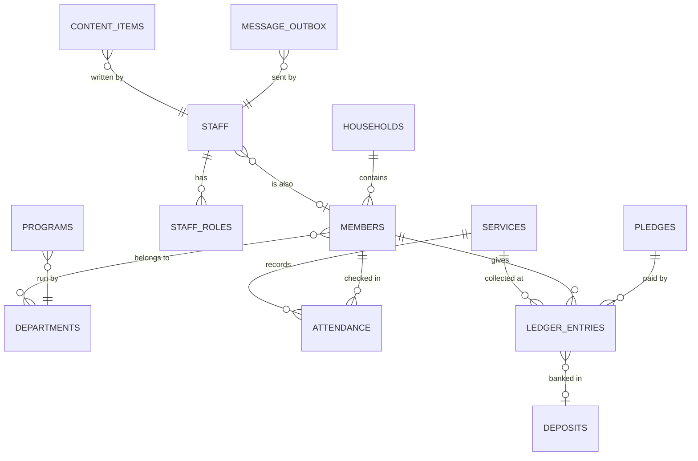
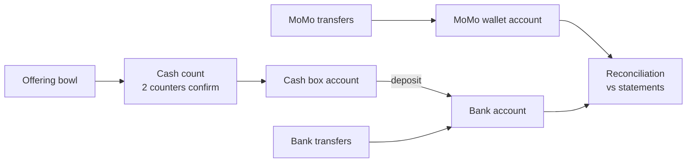

# Church Management System: System Design

Sep 24, 2026 · @Kofi

## Purpose & conventions

This document turns the [PRD](https://claude.ai/code/artifact/222bd20d-dd30-4be4-a961-d4fe1278bcb8) and [System Architecture](https://claude.ai/code/artifact/870b2612-605e-4158-9368-61c6c1dcfe9d) into buildable detail: tables, permission rules, the audit trigger and the GraphQL API. It covers the demo build (ADR-016); the finance section is deliberately flexible until the treasurer interview confirms how money is handled today.

**Conventions (apply to every table)**

| Rule | Convention | Why |
| --- | --- | --- |
| Primary keys | `id uuid default gen_random_uuid()` | Safe to expose in URLs; no guessable sequence |
| Timestamps | `created_at`, `updated_at` as `timestamptz`, set by trigger | One time zone truth; church time zone applied only on display |
| Actor | `created_by uuid references staff(id)` | Who did it, without digging in the audit log |
| Deleting | `archived_at timestamptz` instead of DELETE (MEM-05) | History and links survive |
| Money | `amount_minor bigint` in pesewas/cents + `currency char(3)` | Never floating-point rounding errors |
| Status fields | Postgres `enum` types | Invalid states rejected by the database |
| Naming | `snake_case`, plural table names, singular enum names | Matches pg\_graphql's generated names cleanly |
| Schemas | `public` (app data), `audit` (log), `private` (helpers, never exposed) | Keeps internals out of the GraphQL schema |
| RLS | Enabled on every table at creation | No table is ever accidentally public |

## Data model overview

The model centres on two things: **people** (members and visitors, grouped into households and departments) and **events** (services and programs). Money, attendance and messages all attach to one or both. Staff are separate from members: a staff account can link to a member record, but logging in is never required to be a member.



| Area | Tables | PRD |
| --- | --- | --- |
| Identity & access | `staff`, `staff_roles`, `departments` | SET-02, roles matrix |
| Congregation | `households`, `members`, `member_departments`, `visitor_followups`, `services`, `attendance_counts`, `attendance_checkins`, `programs`, `program_participants` | MEM, ATT, PRG |
| Finance | `accounts`, `ledger_entries`, `cash_counts`, `deposits`, `pledges`, `expenses`, `business_units`, `statement_lines`, `financial_periods` | FIN |
| Content | `content_items`, `sermons` | CNT |
| Messaging | `message_templates`, `message_outbox` | MSG |
| System | `settings`, `features`, `lookup_values`, `audit.log` | SET, AUD |

## Identity & access

Supabase Auth owns passwords and two-factor secrets in its own `auth.users` table. We never store credentials; our `staff` table only holds profile and status, keyed to the auth user.

```sql
create type app_role as enum (
  'super_admin', 'pastor', 'treasurer', 'secretary',
  'usher', 'department_head', 'content_editor'
);

create table departments (
  id uuid primary key default gen_random_uuid(),
  name text not null unique,          -- Choir, Youth, Children...
  is_childrens_ministry boolean not null default false,
  archived_at timestamptz
);

create table staff (
  id uuid primary key references auth.users(id),
  full_name text not null,
  phone text,
  member_id uuid references members(id),   -- optional link
  is_active boolean not null default true,
  created_at timestamptz not null default now(),
  updated_at timestamptz not null default now()
);

create table staff_roles (
  id uuid primary key default gen_random_uuid(),
  staff_id uuid not null references staff(id),
  role app_role not null,
  department_id uuid references departments(id), -- only for department_head
  granted_by uuid references staff(id),
  granted_at timestamptz not null default now(),
  unique nulls not distinct (staff_id, role, department_id)
);
```

**Rules**

- A person can hold several roles (e.g. secretary and content editor).
- `department_head` rows must name a department; other roles must not (check constraint).
- Deactivating staff sets `is_active = false` and revokes sessions; the row stays for audit history.
- Only `super_admin` can write `staff_roles`, and cannot remove the last super admin (enforced in the `grant_role` / `revoke_role` functions).

## Congregation

Members and visitors share one `members` table with a status, so converting a visitor (MEM-02) is a status change, not a copy. Attendance supports both headcount and per-person check-in (ATT-02) until the church confirms which it uses.

```sql
create type member_status as enum
  ('visitor', 'active', 'inactive', 'transferred', 'deceased');

create table households (
  id uuid primary key default gen_random_uuid(),
  name text not null,               -- "The Mensah Family"
  address text,
  archived_at timestamptz
);

create table members (
  id uuid primary key default gen_random_uuid(),
  household_id uuid references households(id),
  first_name text not null,
  last_name text not null,
  phone text, email text,
  date_of_birth date,               -- drives is_minor
  gender text, marital_status text,
  status member_status not null default 'visitor',
  first_visit_on date, joined_on date,
  sms_opt_out boolean not null default false,   -- MSG-04
  consent_recorded_at timestamptz,              -- data protection
  created_at timestamptz not null default now(),
  updated_at timestamptz not null default now(),
  archived_at timestamptz
);
-- is_minor computed in a view/function from date_of_birth,
-- used by RLS to protect children's records

create table member_departments (
  member_id uuid references members(id),
  department_id uuid references departments(id),
  primary key (member_id, department_id)
);

create table visitor_followups (
  id uuid primary key default gen_random_uuid(),
  member_id uuid not null references members(id),
  assigned_to uuid references staff(id),
  status text not null default 'pending',  -- pending, contacted, done
  notes text, due_on date
);

create type service_type as enum ('sunday', 'midweek', 'special', 'program');

create table services (
  id uuid primary key default gen_random_uuid(),
  name text not null,               -- "Sunday First Service"
  type service_type not null,
  starts_at timestamptz not null,
  program_id uuid references programs(id)
);

create table attendance_counts (    -- headcount mode
  service_id uuid primary key references services(id),
  men int not null default 0, women int not null default 0,
  children int not null default 0, visitors int not null default 0,
  recorded_by uuid not null references staff(id)
);

create table attendance_checkins (  -- per-person mode
  service_id uuid references services(id),
  member_id uuid references members(id),
  checked_in_by uuid not null references staff(id),
  checked_in_at timestamptz not null default now(),
  primary key (service_id, member_id)
);

create table programs (
  id uuid primary key default gen_random_uuid(),
  name text not null, description text,
  department_id uuid references departments(id),
  lead_staff_id uuid references staff(id),
  starts_on date, ends_on date,
  archived_at timestamptz
);

create table program_participants (
  program_id uuid references programs(id),
  member_id uuid references members(id),
  primary key (program_id, member_id)
);
```

For the demo, `members` is filled with fake Ghanaian-style names and phone numbers from a seed script; see the last section.

## Finance

The system records and checks money; it never moves it. Every money event is one row in an append-only **ledger**, tagged with *where the money is* (cash box, MoMo wallet, bank account) and *what it is* (offering, tithe, expense...). This single design supports both ways the finance team might work, chosen by a setting after the treasurer interview:

| Mode | What staff enter | What the system does |
| --- | --- | --- |
| **Summary** (light) | Final totals per service and channel, as calculated today | Stores, totals by month, reports, reconciles |
| **Itemised** (full) | Each tithe, MoMo transfer or bank payment | Calculates totals itself, per-member statements (FIN-08) |

Both modes write to the same tables, so switching later needs no migration.

### How money flows through the records



### Tables

```sql
create type account_type as enum ('cash', 'momo', 'bank');
create table accounts (              -- where money sits
  id uuid primary key default gen_random_uuid(),
  name text not null,                -- "Cash box", "Church MoMo", "Main bank"
  type account_type not null,
  reference text,                    -- masked wallet/account number
  currency char(3) not null default 'GHS',
  archived_at timestamptz
);

create type entry_category as enum (
  'offering', 'tithe', 'pledge_payment', 'donation',
  'business_revenue', 'expense', 'transfer_in', 'transfer_out', 'reversal'
);

create table financial_periods (     -- FIN-07 monthly close
  id uuid primary key default gen_random_uuid(),
  month date not null unique,        -- first day of month
  status text not null default 'open',  -- open, closed, approved
  closed_by uuid references staff(id), approved_by uuid references staff(id)
);

create table ledger_entries (
  id uuid primary key default gen_random_uuid(),
  period_id uuid not null references financial_periods(id),
  account_id uuid not null references accounts(id),
  category entry_category not null,
  direction smallint not null check (direction in (1, -1)),  -- in / out
  amount_minor bigint not null check (amount_minor > 0),
  currency char(3) not null default 'GHS',
  occurred_on date not null,
  entry_mode text not null,          -- 'summary' | 'itemised'
  member_id uuid references members(id),       -- null = anonymous / summary
  service_id uuid references services(id),
  pledge_id uuid references pledges(id),
  business_unit_id uuid references business_units(id),
  expense_id uuid references expenses(id),
  cash_count_id uuid references cash_counts(id),
  external_ref text,                 -- MoMo transaction ID, bank reference
  reverses_entry_id uuid unique references ledger_entries(id),
  note text,
  created_by uuid not null references staff(id),
  created_at timestamptz not null default now()
  -- no updated_at: rows are never updated
);

create table cash_counts (           -- FIN-01, two counters
  id uuid primary key default gen_random_uuid(),
  service_id uuid not null references services(id),
  total_minor bigint not null,
  denominations jsonb,               -- optional {"200": 4, "50": 10, ...}
  counter_1 uuid not null references staff(id),
  counter_2 uuid references staff(id),
  confirmed_at timestamptz,          -- set when counter_2 confirms
  check (counter_2 is null or counter_2 <> counter_1)
);

create table pledges (
  id uuid primary key default gen_random_uuid(),
  member_id uuid not null references members(id),
  purpose text not null, amount_minor bigint not null,
  due_on date, status text not null default 'active'
);

create table business_units (        -- bookshop, hall rental...
  id uuid primary key default gen_random_uuid(),
  name text not null unique, archived_at timestamptz
);

create type expense_status as enum
  ('draft', 'submitted', 'approved', 'rejected', 'paid');
create table expenses (
  id uuid primary key default gen_random_uuid(),
  category text not null, description text not null,
  amount_minor bigint not null check (amount_minor > 0),
  receipt_path text,                 -- private storage bucket
  status expense_status not null default 'draft',
  requested_by uuid not null references staff(id),
  approved_by uuid references staff(id),
  check (approved_by is null or approved_by <> requested_by)
);

create table statement_lines (       -- imported MoMo/bank statements
  id uuid primary key default gen_random_uuid(),
  account_id uuid not null references accounts(id),
  occurred_on date not null,
  amount_minor bigint not null, direction smallint not null,
  external_ref text, description text,
  matched_entry_id uuid references ledger_entries(id),
  imported_by uuid not null references staff(id)
);
```

### Rules the database enforces

- **No edits, ever.** Ledger rows have no UPDATE or DELETE permission for anyone. A mistake is fixed with `reverse_ledger_entry(id, reason)`, which writes an equal and opposite `reversal` row.
- **Closed months are frozen.** Inserts into a `closed` or `approved` period are rejected; corrections go into the current month with a note.
- **Cash needs two people.** A cash count only becomes a ledger entry once `counter_2` confirms.
- **No self-approval.** An expense's approver can't be its requester; only `paid` expenses create an outgoing ledger entry.
- **Deposits are transfers, not income.** Moving cash to the bank writes a `transfer_out` from the cash box and a `transfer_in` to the bank, so income is never counted twice.

### Reconciliation

For each account and month, a view compares recorded ledger totals with imported statement lines (uploaded as a CSV from the MoMo or bank statement). Lines are matched on `external_ref`, then on amount + date; anything unmatched on either side is listed for the treasurer to explain. In the demo, statements are uploaded manually; an automatic MoMo or bank feed can later fill `statement_lines` through a provider adapter (ADR-016).

## Content, messaging & system tables

**Content.** One `content_items` table covers announcements, quote of the week, history pages and weekly activities, so the approval flow (CNT-07) is written once. Sermons get their own table for media and search fields.

```sql
create type content_kind as enum ('announcement', 'quote', 'page', 'activity');
create type content_status as enum ('draft', 'in_review', 'published', 'archived');

create table content_items (
  id uuid primary key default gen_random_uuid(),
  kind content_kind not null,
  slug text unique,                  -- for pages: /history, /about
  title text not null,
  body text,                         -- Markdown
  image_path text,                   -- public storage bucket
  status content_status not null default 'draft',
  publish_at timestamptz,            -- scheduled publishing
  expires_at timestamptz,            -- announcements auto-expire (CNT-06)
  author_id uuid not null references staff(id),
  approved_by uuid references staff(id),
  created_at timestamptz not null default now(),
  updated_at timestamptz not null default now()
);

create table sermons (
  id uuid primary key default gen_random_uuid(),
  title text not null, preacher text not null,
  preached_on date not null, series text, scripture text,
  notes text,
  video_url text,                    -- YouTube link, embedded
  audio_path text,                   -- public storage bucket
  status content_status not null default 'draft',
  author_id uuid not null references staff(id),
  approved_by uuid references staff(id)
);
```

**Messaging.** Nothing is sent directly. Every message becomes rows in `message_outbox`; in the demo a job marks them `simulated`, later a provider adapter delivers them (ADR-016).

```sql
create table message_templates (
  id uuid primary key default gen_random_uuid(),
  name text not null unique,         -- "Visitor welcome"
  channel text not null,             -- 'sms' | 'email'
  body text not null                 -- "Hi {{first_name}}, ..."
);

create table message_outbox (
  id uuid primary key default gen_random_uuid(),
  batch_id uuid not null,            -- one send to a department = one batch
  channel text not null,
  member_id uuid references members(id),
  to_address text not null,
  body text not null,
  status text not null default 'queued',  -- queued, simulated, sent, failed, skipped_opt_out
  provider text,                     -- 'outbox' in demo
  provider_message_id text,
  sent_by uuid not null references staff(id),
  created_at timestamptz not null default now(),
  sent_at timestamptz
);
```

**System.**

```sql
create table settings (               -- single row: church profile (SET-01)
  id boolean primary key default true check (id),
  church_name text not null,
  currency char(3) not null default 'GHS',
  time_zone text not null default 'Africa/Accra',
  finance_mode text not null default 'summary',  -- summary | itemised
  logo_path text
);

create table features (               -- paid modules switched on later
  key text primary key,              -- 'sms', 'email', 'online_giving'
  enabled boolean not null default false,
  note text                          -- "Awaiting church budget approval"
);

create table lookup_values (          -- SET-03 editable lists
  id uuid primary key default gen_random_uuid(),
  list text not null,                -- 'expense_category', 'payment_method'...
  value text not null,
  sort_order int not null default 0,
  unique (list, value)
);
```

The public website reads only `content_items` and `sermons` rows where `status = 'published'` and `publish_at <= now()`, plus `services` for weekly activities.

## Permissions (row-level security)

Every GraphQL query runs as the signed-in Postgres user, so these policies are the real permission system. The PRD's permission matrix translates into policies through a few helper functions in the `private` schema (never exposed to GraphQL).

```sql
-- Does the current user hold this role?
create function private.has_role(r app_role) returns boolean
language sql stable security definer set search_path = '' as $$
  select exists (
    select 1 from public.staff_roles sr
    join public.staff s on s.id = sr.staff_id
    where sr.staff_id = auth.uid() and sr.role = r and s.is_active
  );
$$;

-- Any of several roles
create function private.has_any_role(rs app_role[]) returns boolean ...;

-- Is the current user head of this department?
create function private.heads_department(dept uuid) returns boolean ...;
```

Policies call them wrapped in `(select ...)` so Postgres evaluates them once per query, not once per row.

**Two-factor in the database (LBC-41).** The helpers count super admin, pastor and treasurer (`private.mfa_required_roles()`) as held only when the JWT claim `aal` is exactly `aal2`; a missing, malformed or any other value fails closed. Other roles ignore `aal`, and a user holding both kinds keeps the second kind at aal1. `private.is_active_staff()` deliberately ignores `aal`: it gates only the `staff_select_self` and `staff_roles_select_self` policies, so a signed-in user can read their own profile and roles before the second factor is verified. `audit.log_event` (behind `log_audit_event`) uses `private.has_dashboard_session()`: active staff, and aal2 when they hold a two-factor role.

**Example policies**

```sql
alter table members enable row level security;

-- Office, pastor, admin see all adult members
create policy members_read_office on members for select to authenticated
using (
  (select private.has_any_role('{super_admin,pastor,secretary}'))
  and (not private.is_minor(date_of_birth)
       or (select private.has_any_role('{super_admin,pastor}')))
);

-- Department heads see their own department's members
create policy members_read_dept on members for select to authenticated
using (exists (
  select 1 from member_departments md
  where md.member_id = members.id
    and private.heads_department(md.department_id)
));

-- Only the office writes member records
create policy members_write on members for insert to authenticated
with check ((select private.has_any_role('{super_admin,secretary}')));

-- Ledger: treasurer inserts; nobody updates or deletes
alter table ledger_entries enable row level security;
create policy ledger_insert on ledger_entries for insert to authenticated
with check ((select private.has_role('treasurer')) and created_by = auth.uid());
create policy ledger_read on ledger_entries for select to authenticated
using ((select private.has_any_role('{super_admin,pastor,treasurer}')));
revoke update, delete on ledger_entries from authenticated, anon;

-- Public site: anonymous visitors read published content only
create policy content_public on content_items for select to anon
using (status = 'published' and publish_at <= now()
       and (expires_at is null or expires_at > now()));
```

**Names-only access.** Ushers and the treasurer need member names (for check-in and tithes) but not phone numbers or addresses. RLS works on rows, not columns, so they get no policy on `members` and instead read a narrow `member_names` view (id, first and last name, status) that checks their role itself.

**Children's records.** `private.is_minor(date_of_birth)` hides under-18s from everyone except super admin, pastor and heads of children's ministry departments.

Every policy gets a pgTAP test per role: "an usher cannot read `ledger_entries`", "a department head sees only their department".

## Audit trail

One generic trigger records every insert, update and archive on business tables into `audit.log` (AUD-01). Because it runs inside the database, it catches changes from the app, background jobs and anyone with direct database access alike.

```sql
create schema audit;

create table audit.log (
  id bigint generated always as identity primary key,
  occurred_at timestamptz not null default now(),
  actor_id uuid,                     -- auth.uid(); null for system jobs
  table_name text not null,
  record_id uuid not null,
  action text not null,              -- INSERT, UPDATE, DELETE, LOGIN, EXPORT
  old_data jsonb,
  new_data jsonb,
  changed_fields text[]              -- for UPDATE: which columns changed
);
create index on audit.log (table_name, record_id);
create index on audit.log (actor_id, occurred_at desc);

create function audit.record_change() returns trigger
language plpgsql security definer set search_path = '' as $$
begin
  insert into audit.log (actor_id, table_name, record_id, action, old_data, new_data, changed_fields)
  values (
    auth.uid(), tg_table_name,
    coalesce(new.id, old.id), tg_op,
    case when tg_op <> 'INSERT' then to_jsonb(old) end,
    case when tg_op <> 'DELETE' then to_jsonb(new) end,
    case when tg_op = 'UPDATE' then
      array(select key from jsonb_each(to_jsonb(new))
            where to_jsonb(new) -> key is distinct from to_jsonb(old) -> key)
    end
  );
  return coalesce(new, old);
end $$;

-- attached to every business table, e.g.
create trigger audit_members after insert or update or delete on members
for each row execute function audit.record_change();
```

**Protections**

- App roles (`authenticated`, `anon`) have no INSERT, UPDATE or DELETE on `audit.log`; only the security-definer trigger writes to it.
- Nobody can edit or delete rows, including super admin. Only the database owner could, and that key is held outside the app.
- Reads go through a `list_audit_log(filters)` function limited to super admin and pastor (AUD-02).
- Logins and exports are logged by calling `audit.log_event('LOGIN' | 'EXPORT', ...)` from the dashboard server.
- Sensitive values in `old_data`/`new_data` (e.g. phone numbers of archived minors) can be redacted on anonymisation requests by a documented, audited admin procedure, not by editing rows ad hoc.
- Retention: financial audit rows kept at least 7 years (PRD non-functional requirements).

## GraphQL API

pg\_graphql generates the schema from the `public` schema (ADR-015). Tables become collections with filtering, ordering and cursor pagination; relationships become nested fields; Postgres functions become queries (if `stable`) or mutations (if `volatile`). Name inflection is turned on so the API uses camelCase:

```sql
comment on schema public is e'@graphql({"inflect_names": true})';
```

**Rule of thumb.** Simple reads and simple writes (e.g. updating a member's phone) use generated collections. Anything with a business rule is a function, and the generated insert/update/delete for that table is disabled by RLS so the function is the only way in.

| Operation | Kind | Backed by | PRD |
| --- | --- | --- | --- |
| `membersCollection` | Query | `members` + RLS | MEM-01, MEM-04 |
| `convertVisitorToMember(memberId)` | Mutation | function | MEM-02 |
| `recordAttendanceCounts(serviceId, ...)` | Mutation | function (upsert, one per service) | ATT-02 |
| `startCashCount` / `confirmCashCount(id)` | Mutation | functions; confirm creates ledger entry | FIN-01 |
| `recordLedgerEntry(input)` | Mutation | function: checks period open, role, mode | FIN-01–05 |
| `reverseLedgerEntry(id, reason)` | Mutation | function | FIN-06 |
| `recordDeposit(fromAccount, toAccount, amount, ref)` | Mutation | function: writes the transfer pair | FIN-01 |
| `submitExpense` / `approveExpense` / `markExpensePaid` | Mutation | functions with status checks | FIN-04 |
| `closePeriod(month)` / `approvePeriod(month)` | Mutation | functions | FIN-07 |
| `reconciliation(accountId, month)` | Query | stable function returning totals + unmatched lines | FIN |
| `queueMessages(templateId, audience)` | Mutation | function: expands audience, skips opt-outs, fills outbox | MSG-01, MSG-04 |
| `publishContent(id)` / `approveContent(id)` | Mutation | functions | CNT-07 |
| `listAuditLog(filters)` | Query | stable function, admin/pastor only | AUD-02 |

**Example: dashboard member profile**

```graphql
query MemberProfile($id: UUID!) {
  membersCollection(filter: { id: { eq: $id } }) {
    edges { node {
      id firstName lastName phone status
      household { name }
      memberDepartmentsCollection { edges { node { department { name } } } }
      attendanceCheckinsCollection(first: 10, orderBy: [{ checkedInAt: DescNullsLast }]) {
        edges { node { service { name startsAt } } }
      }
    } }
  }
}
```

If the signed-in user can't see this member, RLS returns an empty result; there's no separate permission check to forget.

**Example: record a MoMo tithe**

```graphql
mutation RecordTithe {
  recordLedgerEntry(input: {
    accountId: "..."            # Church MoMo
    category: TITHE
    direction: 1
    amountMinor: 50000         # GH₵ 500.00
    occurredOn: "2026-09-20"
    memberId: "..."
    externalRef: "MOMO-TXN-123456"
  }) { id amountMinor }
}
```

**Guardrails** (from the architecture doc)

- Introspection disabled in production; the schema is exported at build time for GraphQL Code Generator.
- Query depth and page size capped (collections default to 30 rows, max 100).
- The public site calls only persisted queries: `publishedAnnouncements`, `publishedSermons`, `page(slug)`, `quoteOfTheWeek`, `weeklyActivities`.
- Money is always `amountMinor` (integer) over the wire; the client formats it for display.

## Migrations, seed data & testing

**Migrations.** Each change is a timestamped SQL file created with the Supabase CLI (`supabase migration new <name>`) and committed to `supabase/migrations`. Files run in order, so tables are created before anything that references them (e.g. `members` before `staff.member_id`, or the foreign key is added in a later migration). A migration is never edited after it has run on staging; fix forward with a new one.

Suggested order for Phase 1 and the demo:

1. Extensions, schemas (`private`, `audit`), enums, `updated_at` trigger
2. `audit.log` + `audit.record_change()`
3. `departments`, `households`, `members`, `staff`, `staff_roles` + RLS helpers and policies
4. `settings`, `features`, `lookup_values`
5. `services`, attendance tables, `programs`
6. `content_items`, `sermons` (public site slice)
7. Finance tables + functions (after the treasurer interview)
8. Messaging tables + outbox

**Seed data (demo only).** A `seed.sql` script creates one staff account per role (e.g. `usher@demo.church`), around 300 fake members in 80 households, a year of Sundays with attendance, sample offerings across cash, MoMo and bank, a few pledges and expenses, and published sermons and announcements. It is generated with a fixed random seed so every reset gives the same data, and it never contains real people.

**Testing hooks**

| Layer | Tool | Examples |
| --- | --- | --- |
| RLS policies | pgTAP | Each role can/can't read and write each table; minors hidden |
| Finance functions | pgTAP | Reversal nets to zero; closed period rejects inserts; self-approval blocked; deposit doesn't double income |
| Audit | pgTAP | Every table has the audit trigger; `audit.log` rejects UPDATE/DELETE |
| App logic | Vitest | Money formatting, Zod schemas, provider adapters |
| Key journeys | Playwright | Usher records attendance on a phone viewport; treasurer records and reverses an offering |

A CI check lists all `public` tables and fails if any lacks RLS policies or the audit trigger.

## Open questions

- [ ] Finance mode: summary or itemised, and how cash moves to the bank today (treasurer interview).
- [ ] Attendance: headcount, per-person, or both?
- [ ] Which MoMo networks and banks the church uses, and whether statements can be downloaded as CSV.
- [ ] Does anyone besides the treasurer record money (e.g. department treasurers)?
- [ ] Which departments count as children's ministry for access to minors' records?
- [ ] Is a single currency (GHS) enough, or are foreign-currency gifts received?
